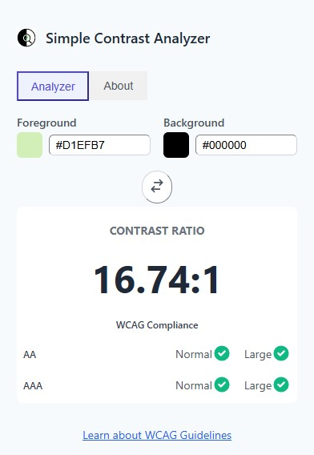

# Simple Contrast Analyzer
A straightforward Chrome Extension for developers and designers to quickly check color contrast ratios against WCAG 2.1 guidelines. Ensure your website is accessible and readable for everyone.

## ✨ Features
+ **Live Eyedropper:** Pick colors directly from any webpage.
+ **Real-Time Analysis:** Get instant contrast ratio results and WCAG (AA/AAA) compliance status.
+ **Manual Input:** Enter hex codes manually for precise color checking.
+ **Instant Swap:** Swap foreground and background colors with a single click.
+ **Clean & Simple UI:** A clutter-free interface designed for speed and efficiency.
+ **Privacy-Focused:** No data is ever collected or stored. All analysis happens locally.

## 🖼️ Screenshots
### Main Interface

### Eyedropper in Action

### Best Result

## ⚙️ Installation (for Local Development)
To install and test the extension locally:

Clone this repository or download it as a ZIP file.

> git clone https://github.com/dizaraj/color-contrast-analyzer.git

Open Google Chrome and navigate to `chrome://extensions`

Enable `Developer mode` using the toggle in the top-right corner.

Click the `Load unpacked` button.

Select the directory where you cloned or unzipped the project files.

The extension icon should now appear in your Chrome toolbar.

## 📖 How to Use
* Navigate to any webpage you want to analyze.
* Click the "Simple Contrast Analyzer" icon in your Chrome toolbar.
* Use the "Pick from page" buttons to activate the eyedropper and select foreground and background colors.
* Alternatively, type or paste hex color codes directly into the input fields.
* The contrast ratio and WCAG compliance status will update instantly.

## Privacy
This extension is built with your privacy in mind. It does not collect, store, or transmit any user data. For more details, please read the full [Privacy Policy](./PRIVACY.md).

## 💬 Support
If you have any questions, require support, or have feedback, please feel free to reach out to the developer:

* **Developer:** Dizaraj Dey
* **Email:** [dizaraj@gmail.com](mailto:dizaraj@gmail.com)
* **WhatsApp:** [+8801717035081](https://wa.me/8801717035081)
* **Messenger:** [m.me/dizaraj](https://m.me/dizaraj)

## ❤️ Support the Project
**Feedback & Contributing:**
Found a bug or have a feature request? Please open an issue on GitHub.
Contributions are welcome! Feel free to fork the repository and submit a pull request.

If you find it useful and would like to support its continued development, maintenance, and the creation of more helpful tools, please consider showing your appreciation. Your support is greatly valued!

